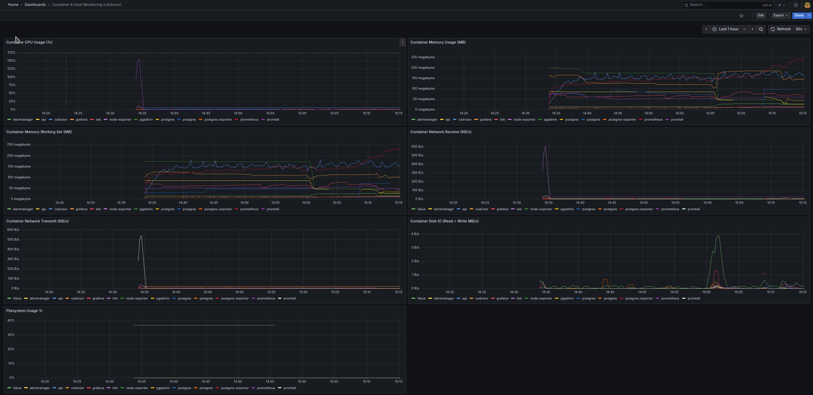

# Membership Manager

A containerized FastAPI application for managing members and yearly memberships, built with modern Python tooling and an automated GitHub Actions–backed CI pipeline.

---

## 🔍 Project Overview

- **Purpose**: CRUD‑style API to create, query, update, and delete members and their yearly memberships.
- **Goals**:
  1. Practice backend development with FastAPI, SQLAlchemy, and Pydantic
  2. Enforce consistent development and testing environments via Docker Compose
  3. Automate linting, testing, and coverage reporting in CI
  4. Generate PDF welcome letters for new or existing members

---

## 🛠 Tech Stack

### - Core Backend

- **Python 3.11**
- **FastAPI** – RESTful API framework
- **SQLAlchemy + Alembic** – ORM and schema migrations
- **Pydantic** – Data validation and configuration management

### - Database

- **PostgreSQL 16** – Relational database
- **pgAdmin** – GUI for PostgreSQL administration

### - PDF Generation

- **WeasyPrint** – HTML/CSS to PDF rendering engine
- **Jinja2** – Templating for personalized letters

### - Infrastructure & Tooling

- **Docker & Docker Compose** – Containerized services
- **Make** – Task automation and local developer tooling

### - Testing & Automation

- **Pytest** – Unit and integration testing
- **GitHub Actions** – CI pipeline (linting, tests, coverage)
- **Ruff + Black** – Linting and formatting

### - Observability & Monitoring

- **Prometheus** – Metrics collection
- **Grafana** – Dashboarding and visualization
- **Loki + Promtail** – Centralized structured logging
- **cAdvisor** – Container-level resource monitoring
- **Alertmanager** – Rule-based alerting

---

## 🚀 Getting Started

1. **Clone & enter**

   ```bash
   git clone https://github.com/liocle/membership-manager.git
   cd membership-manager
   ```

2. **Set up Python**

   ```bash
   python -m venv .venv
   source .venv/bin/activate
   pip install -r app/requirements.txt
   ```

3. **Configure environment**

   - Copy `.env.example` to `.env` and fill in values
   - Ensure `.env.test` contains test DB settings

4. **Start services**

   ```bash
   make
   ```

   - API docs: http://localhost:8000/docs
   - PDF letters are saved to output/letters/ by default

---

## ✅ CI & Branch Protection

- **Workflow file**: `.github/workflows/ci.yml`
- **Triggers**: `pull_request` and manual via `workflow_dispatch`
- **Jobs**:
  1. **Lint & Format Check** (`ruff`, `black --check`)
  2. **Python Tests & Coverage** (`pytest --cov=app`, uploads `coverage.xml`)

**Branch protection** on `main` requires:
- Passing **Python Tests & Coverage** status check
- Lint check executed but do not fail PRs
- PDF Generation Tests

---

## 🧪 Testing & Coverage

Run tests locally with coverage:

```bash
make pytest_local
```

This will:
- Spin up Postgres via Docker Compose
- Recreate the test database
- Execute `pytest` with:
  - `--cov=app`
  - `--cov-report=term-missing`
  - `--cov-report=xml`
  - `--cov-report=html`

Artifacts:
- `coverage.xml` (CI artifact)
- `htmlcov/index.html` (open in browser)

---

## 📁 Project Structure

```
membership-manager/
├─ .github/workflows/ci.yml
├─ docker-compose.yml
├─ Makefile
├─ .env, .env.test
├─ app/
│  ├─ api/          # route modules
│  ├─ models.py     # SQLAlchemy models
│  ├─ schemas.py    # Pydantic schemas
│  ├─ config.py     # settings loader
│  ├─ create_tables.py
│  ├─ database.py
│  └─ pdf/          # PDF generation scripts & templates
│     ├─ generate_welcome_letter.py
│     └─ templates/
│        └─ welcome_letter.html.jinja2
├─ monitoring/
│  ├─ alertmanager/config.yml
│  ├─ Container_Host_Monitoring_cAdvisor.jpeg
│  ├─ grafana/
│  │  ├─ dashboards/
│  │  │  └─ docker_metrics_grafana_cadvisor.json
│  │  └─ provisioning/
│  │     ├─ dashboards/dashboards.yml
│  │     └─ datasources/datasource.yml
│  ├─ loki/loki-local-config.yml
│  ├─ monitoring_README.md
│  ├─ PostgreSQL.jpeg
│  ├─ Prometheus.jpeg
│  ├─ Prom_FastAPI.jpeg
│  ├─ prometheus/prometheus.yml
│  ├─ prometheus/rules/container_alerts.yml
│  └─ promtail-config.yml
├─ output/
│  └─ letters/      # Generated PDF files (gitignored)
├─ tests/           # pytest suite
│  └─ test_generate_welcome_letter_route.py
├─ coverage.xml     # coverage artifact
├─ htmlcov/         # HTML coverage report
└─ requirements.txt
```

---

## ⚙️ Makefile

- `make`                – start Postgres, API & pgAdmin
- `make pytest_local`   – run tests with coverage reports
- `make create_db`      – run DB init script
- `make seed_db`        – seed sample data
- `make help`           – display full command list

---

## 📄 Sample Welcome Letter


---

## 📊 Observability & Monitoring

This project provisions a complete observability stack with a single command:

```bash
make up_all
```

All services (Prometheus, Grafana, Loki, cAdvisor, etc.) are orchestrated via Docker Compose and automatically configured. On launch, Grafana loads a **prebuilt dashboard** to display real-time container metrics such as:

- CPU, memory, and network usage
- Disk I/O and container health

📁 For screenshots and config details, see [`monitoring/`](./monitoring/) and [monitoring_README.md](./monitoring/monitoring_README.md).

### 🔍 Example Grafana Dashboard



---

## 📄 License

MIT © 2025 Lionel Clerc

