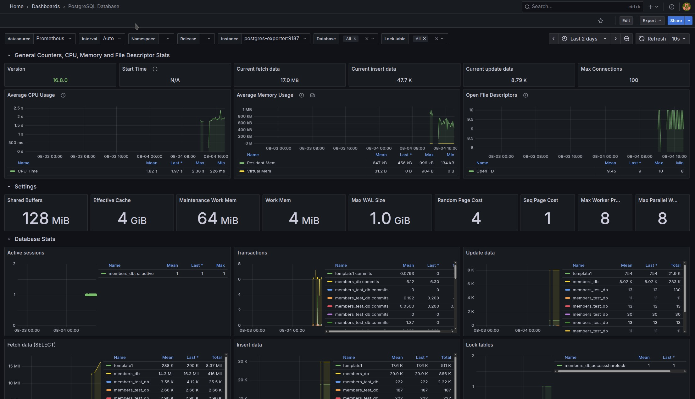
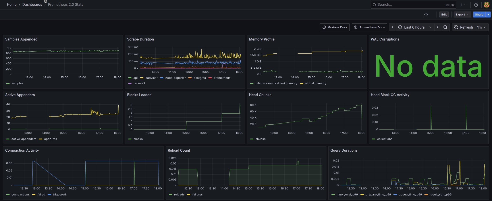
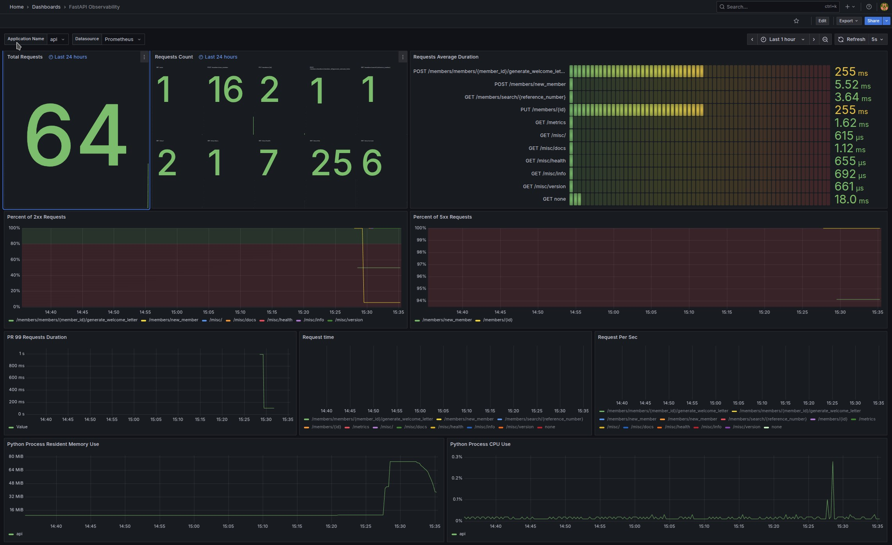

# 📈 Observability Stack Overview

This directory contains the configuration and supporting files for the observability stack integrated into the Membership Manager project. The components are containerized and orchestrated via Docker Compose, and allow introspection of metrics, logs, and alerting conditions across services.

---

## 🔧 Components and Roles

### Prometheus
- **Purpose**: Metrics scraping and long-term storage.
- **Role**: Collects metrics from services like FastAPI, PostgreSQL exporter, cAdvisor, and Promtail.
- **Config**: [`monitoring/prometheus/prometheus.yml`](prometheus/prometheus.yml)

### Grafana
- **Purpose**: Visualization and dashboarding.
- **Role**: Displays metrics stored by Prometheus and logs pushed via Loki.
- **Dashboards**: Includes dashboards for PostgreSQL, FastAPI, Prometheus internals, host metrics, and containers.
- **Config**:
  - [`monitoring/grafana/provisioning/datasources/datasource.yml`](grafana/provisioning/datasources/datasource.yml)
  - [`monitoring/grafana/dashboards/`](grafana/dashboards/)

### Loki
- **Purpose**: Log aggregation backend.
- **Role**: Stores logs pushed by Promtail. Optimized for indexing metadata (labels), not full-text.
- **Config**: [`monitoring/loki/loki-local-config.yml`](loki/loki-local-config.yml)

### Promtail
- **Purpose**: Log shipper and parser.
- **Role**: Reads container logs and sends them to Loki. Docker logs are parsed and enriched with custom labels like `level`, `path`, `method`, `status`, and more.
- **Labels Added**: Enables querying logs by request metadata (e.g. HTTP method, status code, file path).
- **Config**: [`monitoring/promtail-config.yml`](promtail-config.yml)

### Alertmanager
- **Purpose**: Notification routing and alert delivery.
- **Role**: Sends alerts triggered by Prometheus rules (e.g. container down).
- **Config**: [`monitoring/alertmanager/config.yml`](alertmanager/config.yml)

---

## 🧪 Test Coverage

The following verifications were performed:

- **Prometheus & AlertManager**: A test under `tests/monitoring/test_monitoring_alerts.py` asserts the `/api/v1/alerts` endpoint becomes non-empty when alerts are active.
- **Label Enrichment**: Promtail config was modified to parse JSON-formatted Docker logs, extract fields via regex, and assign them as labels. These include:
  - `level`, `method`, `status`, `duration`, `path`
- **Visual Tests**: Successful ingestion confirmed in Grafana using these enriched labels.

---

## 📁 Directory Structure

```
monitoring/
├── alertmanager/
│   └── config.yml
├── grafana/
│   ├── dashboards/
│   │   ├── *.json
│   └── provisioning/
│       ├── dashboards/
│       │   └── dashboards.yml
│       └── datasources/
│           └── datasource.yml
├── loki/
│   └── loki-local-config.yml
├── prometheus/
│   ├── prometheus.yml
│   └── rules/
│       └── container_alerts.yml
├── promtail-config.yml
└── monitoring_README.md
```

---

## 🖼️ Screenshots (sample dashboards)

### PostgreSQL Dashboard


### Host Metrics Dashboard


### FastAPI Dashboard


